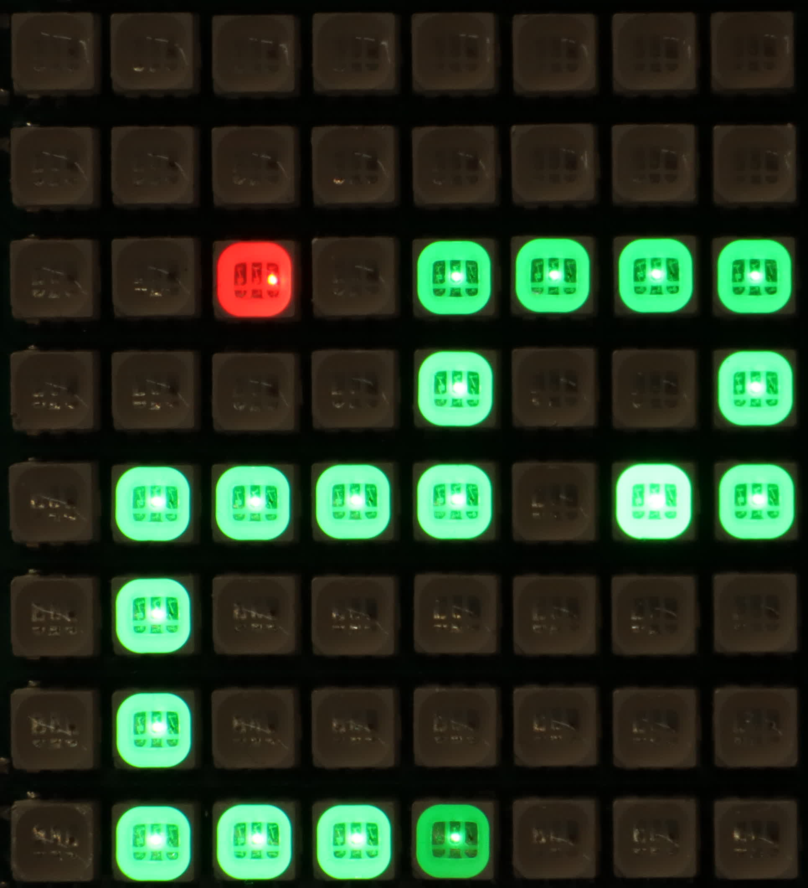
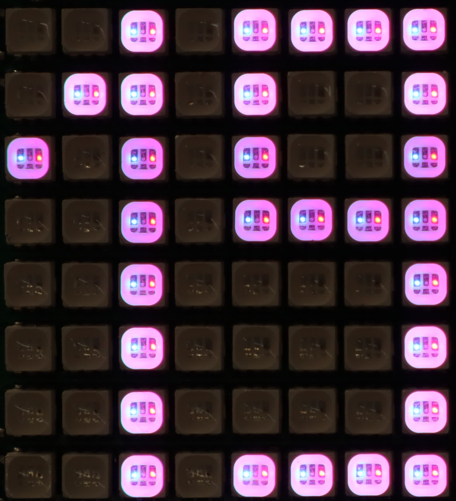
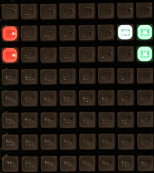
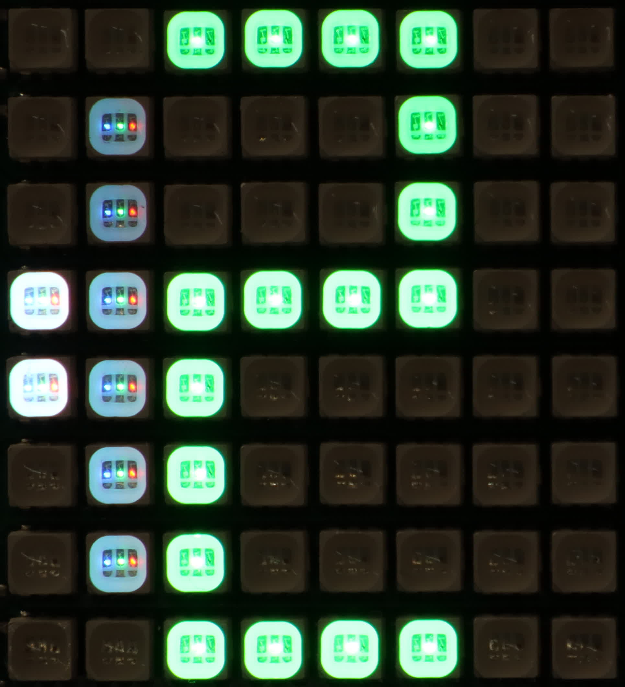

# __Project IoNoW__
#### Student Name: Luka Milenkovic
#### Home Uni: el25b216@technikum-wien.at
#### Guest Uni: 20120147@setu.ie

Assignment from the IoT Standards & Protocols course of 2026 at [SETU Ireland](https://setu.ie) part of the Study@Home program at [UAS Technikum Wien](https://technikum-wien.at/en).

# __Introduction__
This project focuses on the realtime aspects of modernday IoT infrastructure. Instead of the usual temperature & humidity graphs, here the _sensors_ are a joystick and a gyroscope, with an 8x8 rgb matrix as the _actuator_. Treating those like any other sensor readings, the goal was to develop an IoT infrastructure fast & efficient enough to make playing, for example, a game of pong on a Raspi SenseHAT possible like it was running locally, except that all of the game logic is an IoT automation running on the server. The Raspi acting as just a simple IoT end-device, treated no differently than a 5-button smart light switch with a screen.

Most IoT platforms focus on data collection and visualisation. Some others also prioritize responsiveness _to some degree_ in the sense of buttons or lights that _quickly enough_ as to not harm the user experience much. This tends to be around 1 to 3 seconds. My goal is actual realtime, bidirectional data integration; so more like 10 to 100ms.

This repository contains all of the _Project IoNoW_ specific code (sensors, buttons, games, raspi, python, etc.), the general-purpose background-code responsible for handling all the connections, protocols, API routing and DB are all part of a self-made library called [KisDB](https://github.com/KhanKudo/kisdb). It was actively developed in parallel and is a core element of Project IoNoW, which wouldn't have been possible without it. The KisDB commits from March 10th (c6fcdf5) to April 24th (ea5a82f) are to be treated as a part of this submission, considering that about 59% of the total project time was spent there (according to my ___wakatime___ tracker, respectively IoNoW & KisDB: 48h | 68h). The code is split like this, because nothing from KisDB is specific to IoNoW and I absolutely intend on continuing it's development alongside my future projects.

Whilst this project exclusively processes everything on the backend, in a real deployment a sensible mixture of firmware & backend processing would be used. The actual goal is to make this dynamic interaction much easier to implement and adapt. But showing that it can work in this extreme-case is a great example.

# __Demonstration__
TODO
<!--TODO: add link/preview of demonstrational video presentation for the final submission through YouTube-->

# __Project Overview__
TODO


  <!--TODO: update graphic -->

# __Getting Started__
A quick guide on how to run everything from this project yourself.
## __Raspberry Pi SenseHAT Client__
Firstly download Raspberry Pi OS (Lite on the Pi 3B was used here) from the [downloads page](https://www.raspberrypi.com/software/operating-systems/) and follow official instructions for the installation. In this project, the default linux user on the Pi was called 'raspi', if your's is different, you will have to adjust the provided systemd [service file](sensehat/project-ionow.service) `setu-iot-2026/sensehat/project-ionow.service`. After booting into the OS, we can start by installing the required packages.
```bash
# do initial one-time apt-setup for the Pi
sudo apt-get update
sudo apt-get upgrade
# the reboot is optional, but certainly doesn't hurt
sudo reboot
```
```bash
# install the required packages
sudo apt-get install git python3 sense-hat python3-websockets
# or your user's $HOME directory here
cd /home/raspi
git clone https://github.com/KhanKudo/setu-iot-2026.git
cd setu-iot-2026
# make sure to adjust the paths in the service file to fit your setup
sudo cp sensehat/project-ionow.service /etc/systemd/system
# load the newly added service
sudo systemctl daemon-reload
# Start now and configure autostart on boot for the just added service
sudo systemctl enable --now project-ionow
```
And that's it for the Pi, the SenseHAT display should now light up with a creeper face until the Python program manages to connect to the IoNoW server (which isn't running yet).
## __Bun IoNoW Server__
In testing, to see the delay between Pi & Server and also to ease quick development, IoNoW was always run on my laptop. It can however be run on the Pi itself too, for this you must only change the appropriate server IP at the top of `/home/raspi/setu-iot-2026/sensehat/main.py` [#](sensehat/main.py#L11)
### __Raspberry Pi__
```bash
# install bun
curl -fsSL https://bun.sh/install | bash
# reload $PATH
source ~/.bashrc
# enter the project's server directory
cd /home/raspi/setu-iot-2026/server
# install dependencies (aka. kisdb)
bun install
# start the local server on port 3000
bun run start
```
### __Linux Laptop__
```bash
# install bun
curl -fsSL https://bun.sh/install | bash
# clone the project repository
git clone https://github.com/KhanKudo/setu-iot-2026.git
# enter the project's server directory
cd setu-iot-2026/server
# install dependencies (aka. kisdb)
bun install
# start the local server on port 3000
bun run start
# click on the link in the terminal to open the WebUI in your browser
```
### __Windows Laptop__
```powershell
powershell -c "irm bun.sh/install.ps1 | iex"

git clone https://github.com/KhanKudo/setu-iot-2026.git

cd .\setu-iot-2026\server

bun install
bun run start
```

# __Technologies & Tools__

- [HTTP](https://en.wikipedia.org/wiki/HTTP)
  is plainly used for serving the static WebUI source files. Also through KisDB (see below), an HTTP REST-API is provided for interacting with the server & database. It doesn't use any encryption as it doesn't need it for localhost. For public deployments it always sits behind a reverse proxy, in my case [HAProxy](https://www.haproxy.com/). It is much more secure to let dedicated software handle specialized security than relying on individual implementations.

- [WebSockets](https://en.wikipedia.org/wiki/WebSocket)
  were used through KisDB (see below) to also serve as a method of connecting the clients to the server & database. Unlike Plain HTTP requests, a websocket connection keeps a persistently open bi-directional tcp-socket, so without any further http, both the server and client can in realtime talk to eachother with less overhead, usually being more performant and stable for streaming events both ways.

- [MQTT](https://en.wikipedia.org/wiki/MQTT)
  is perhaps the most standard protocol used in almost any IoT application. It was too _standard_ not to use it, even if it wasn't actually needed for the project at all. Though crucially, it ended up being an incredibly good reference for comparison to http/ws, as it works so differently then those do, which makes for an excellent showcase in the project's demonstration. However it's important to mention that MQTT was a late addition and on a significant time-crunch. Due to it's vastly different inner workings compared to http/ws. So sadly the client cannot handle any connection drops or server restarts without itself being restarted (e.g. WebUI tab reload). Although the server is capable of handling client connects and disconnects (via last-will message), though not if the server itself has a connection issue with the broker. This is a pure time-constraint, functionally it can absolutely be done.

- [KisDB](https://github.com/KhanKudo/kisdb)
  is the library which was developed alongside the project and handles all the networking, routing & database aspects of the projects. It is a crucial library that can be considered a _part of_ this project, it was created as a separate entity just because it has no relation to this submission. It's development will be continued afterwards and it will be a key part of many future projects to come. And yes, kisdb has technically existed for many months before this project was ever even planned, but with IoNoW every single file from the original kisdb project is gone and has it has entirely been turned on it's head. Some goals remained, but most have changed/expanded and it is now much much better than it could have ever been before. As such realistically it's not wrong to say that KisDB is a new project that was started with IoNoW.

- [Bun](https://bun.sh)
  was used as a newer alternative to NodeJS. It has many integrated tools and a significant performance boost compared to plain nodejs. It also natively supports TypeScript and can itself compile a TS module, including all it's imports, into a bundled JavaScript file for the Browser. For this project it was used to build the browser bundle and it's http-router as well as native WebSocket implementation were used through KisDB.

# __Hardware__

- [Raspberry Pi 3B](https://www.raspberrypi.com/products/raspberry-pi-3-model-b/)\
  As provided by the university along with the SenseHAT (see below), the Pi will be used as the main intended user-interface device for the project, alongside the WebUI. It will primarily run the python script for the SenseHAT behaving as a client-device using WebSockets to connect to the main server instance. This main server instance needs to simply run the project with Bun. This can be a local Laptop, or it can also be the Pi itself too.

- [SenseHAT](https://www.raspberrypi.com/documentation/accessories/sense-hat.html)\
  The SenseHAT for the Raspberry Pi is at the core of this project. Everything was designed around it's 8x8 rgb matrix display and 5-button joystick. Additionally it's IMU (gyro & accel) data also ended up being used.

- __Any Laptop__\
  Any laptop or phone can also be used as a client-device through the WebUI. Thanks to the special server-driven-architecture, the WebUI can use arrow-keys, WASD and the Space/Enter keys as equivalent to the SenseHAT joystick. The WebUI also has an on-screen 5-button touch joystick for mobile devices. This Laptop is also where the bun-server can be run, serving the WebUI locally and allowing the Pi to connect.

<!--TODO: add an image or better yet a short gif for each screen-mode -->

# __Display Modes / Games__
- __Demo Game__ [#](server/src/games/demo.ts)

  

  This demo screen very neatly shows off the RGB color of the SenseHAT matrix and also immediately allows the user to experience the low input delay in a game-like environment. It supports any number of unique players, for any new, previously unseen player, it randomly generates a position & color for them. This _blob_ can then only ever be controlled by that player. Using the middle-click, the player can change their color using bitshifts. Once at black, white is also given as an option and then the cycle continues through red, green and blue. Once a player is added, they can only be removed through the API by an admin (or the demo write-only token). Since there are really only 4 user-accounts, at most 4 blobs can realistically exist thus that is fine as a demo. It also utilizes the persistent-memory of the _"Game Engine"_ and saves all player colors and locations. So even across different sessions, client disconnects or server restarts, everything stays exactly how it was.
- __Joystick__ [#](server/src/games/stick.ts)

  

  The joystick demo showcases the raw inputs that the server gets in realtime. Note that unlike the usual single-event button-input in IoT systems, I wanted it to be usable like an actual button. This means full state tracking, so an event for pressing and also releasing. Although the API was also designed to handle single-event buttons, internally assuming a 50ms hold duration, as that's about the standard for a human tap. This screen nicely serves to demonstrate that holding feature and also easily let the user feel any potential delay, though more so it shows how quickly everything reacts to even the slightest taps or wildest spams. In the top-left corner a toggling indicator light was added to show screen updates when e.g. holding down a button on your keyboard in the WebUI and showing the live updates registering each held keystroke is usually repeated by the keyboard or Operating System at 20-30Hz.
- __Gyroscope__ [#](server/src/games/gyro.ts)\
  Identical to the gyroscope, except that it's more responsive and has shown to also deliver more reliable data. It is scaled so that the full screen covers a value-range of -180.0 to +180.0 degrees. Rotating the Raspi will change these values in realtime. Thanks to the advanced delta-line drawing utility, it can achieve a displayed resolution of 7.5° instead of mere 45° without it. This also makes it feel much more responsive as smaller movements also change the display output. The sensor-polling on polling on the Raspi is implemented as an asynchio loop, for it handles WebSocket stuff for 10ms then reads & sends the sensor data. In practice this results in about 5-10 updates per second, as that is all the sensehat library can do because of the significant internal signal processing overhead related to the gyroscope. It is quite known that the gyro-data of the SenseHAT is quite poor, so don't expect sensible results. The accelerometer display (see below) is a far better demo, this was mostly added to showcase why the gyro didn't get used. When a different screen-mode is selected, gyroscope data is no longer updated as it's not needed and more importantly causes very significant lagging inside the Pi's main event loop, vastly impacting the user experience.
- __Accelerometer__ [#](server/src/games/accel.ts)\
  Identical to the gyroscope, except that it's more responsive and has shown to also deliver more reliable data. It is scaled so that the full screen covers a value-range of -1.0 to 1.0. Here when lying flat on a table, the z-axis (blue) will be steady at 1.0 indicating a vertical 1G force (aka gravity) and x-y will be at zero. Moving and/or rotating the device will change these values significantly faster than with the gyro, as this shows the raw, unprocessed IMU readouts.
  Thanks to the advanced delta-line drawing utility, it can achieve a displayed resolution of ~0.042G instead of mere 0.250G without it. That's a 6x improvement and makes everything feel way more lively! The sensor-polling on polling on the Raspi is implemented as an asynchio loop, for it handles WebSocket stuff for 10ms then reads & sends the sensor data. In practice this results in about 30 updates per second. When a different screen-mode is selected, this is reduced to about 5 updates per second to keep the Raspi very responsive and even that is more than needed.
- __Snake Game__ [#](server/src/games/snake.ts)

  

  The classic snake game, can be played by the human user or a simple bot. It keeps track of your achieved score and shows you the result at the end of your round. Snake also utilizes persistent memory to keep track of the player's individual, personal best score (including bots) as well as a human-only global highscore. It even has cool arcade-style flashing _"animations"_ when a player beats their PB or the highscore. Though these can be skipped (reduced to 1/2 a second) by pressing the middle-button. The bot here was primarily made so that for demonstrations, the display could be left running and would show a game of snake, rather a snake going straight into the wall again and again. With that in mind, the bot automatically presses the middle-button for the scores to fast-forward them, to improve the demo. For humans, snake is run at 2fps as that is a good balance. To make idle displays more interesting however, the bot plays at 6fps.

  
  
  <!--
  
  -->
- __Pong Game__ [#](server/src/games/pong.ts)

  

  Here 2 Players are required, either two humans, or a human and a bot, or even two bots. Here the bot was made to actually enable you, the single-user to play pong as a game, as it's hardly any fun if your opponent doesn't ever move at all. The two-bot support is a nice bonus, so that it can be left running as a demo. Unlike snake, pong has no score-tracking. Snake demonstrates that possibility already and to maximize time efficiency, pong was left without it. An interesting effect in pong was the gameloop. So pong has a gametick of 250ms to not make it stressful but also keep it entertaining. this is where the players movements whilst holding down a button are updated. However testing revealed that this made the game feel unresponsive and laggy. So a 250ms movement cooldown was instead implemented, thanks to the cooldown helper-function, keeping the gameloop hold-moving but adding an on-click immediate update on the button-press. With the cooldown in place, the player would appropriately not be moved on the following gametick and spam-clicking is also prevented this way.
    
<!---->

## __Switching Display Modes__ [#](server/src/index.ts#L25-42)
There are two main ways of switching the display modes:

1. __From the WebUI__, any display-mode can manually be selected. A list of all modes is always displayed, which let's you pick simply click on any of them. This always works, except when the 'anonymous' Identity is selected, as that is just a spectator and doesn't have the permissions to interact with anything. So clicking will have no effect unless one of the 'web-X' users is selected.
2. __From the Raspi__ you can actually just turn it upside-down and the display-modes will be cycled in their defined order at an interval of 750ms. The Pi's rotation is updated about 5 times per second, so you can actually quite quickly turn it upside-down and immediately back up-right to only go to the next gamemode. Keeping it upside-down will keep cycling at 1.5Hz. An exception to this rule are `accel` and `gyro` displays. Since they rely on the Pi's movement/orientation in order to fully experience them, the Pi needs to rotate without skipping to the next screen. For those two cases, the middle-click button on the Pi's joystick can be pressed instead. This also illustrates the custom permissions that are possible, as only the Pi's joystick middle-click can cycle to the next game, if anyone else tries to, nothing will happen. This behavior is linked to the raspi identity and has nothing to do with client-code.

# __Game Loader Utility__ [#](server/src/game.ts)
This is a helper file that handles everything around starting/stopping and switching the currently active display-mode (aka. game).
## __Features__
- __Life-Cycles__ of all screens/display-modes/games are handled by it. Loading, starting, running and stopping games, along with all the related bots, input hooks and pending promises (awaitables) is all handled by it.
- __Input Hooks__ are provided to each game on start, so that the game can easily define listener functions for specific button click or the whole state of the joystick. If the game uses an gameloop and doesn't need dynamic input hooks, a live-updating object-reference to the current state of inputs is provided to the game as well.
- __Persistent Memory__ is a must-have for scoreboards (snake) or player positions (demo). It provides the game with an arbitrary property-reference which it can locally read from and write to with any JavaScript supported data, after all it's a normal JS Variable. It's contents are automatically saved by the game-utility and loaded when the game is started. A `save` function is also provided to manually save important achievements, although the auto-save on game-stop and server-stop is very reliable.
- __Game Loops__ are crucial for games that run at a fixed internal such as snake. The player has no influence over how fast the snake moves, only in which direction. The `gameloop` helper functions enables games to do exactly that, register for one (or many) time-fixed (e.g. X fps) loops that the game-utility will automatically keep track of and handle when the game stopping when the game is closed. It also can optionally automatically trigger a screen-render based on the default-matrix-grid at the end of each gameloop iteration, though by default disabled.
- __Subscriptions__ to any KisDB path/value can also be made and automatically started/stopped by the game-helper when the game is stopped.
- __Async Events__ are needed if a game ever has to for example read a value from KisDB once, not subscribe to it, wait for the response and continue execution after. The `after` helper function here does exactly that, it accepts a JavaScript Promise and a callback function. Should the game be stopped before the promise could be settled, it will automatically be rejected and continued game execution is prevented.

# __Important Helper-Functions__

- __Player Selector__ [#](server/src/helpers.ts#L113-333)\
  This function can be used inside of a game. It allows for selecting between 0 and 4 human players, with the required remainder auto-initiated with game-provided bots. The game must specify a required total player count (bots or humans or mixed) and may provide any number of bots. From there, the Helperfunction takes care of all display functions and user-inputs. It calculates the minimum and maximum number or human players required to satisfy total player count, based on provided bot-count. Then it allow the player to scroll left-right using the joystick and select the number of human players they wish to have (using middle-button of joystick). If more than one human player was selected, a 1 through 4 ordered screen will show up, allowing players to middle-click to register themselves as the shown player number (1-4). If 0 or 1 human players are selected, this is skipped as the choice is clear.

  To improve clarity of use, dynamic arrows on the sides are shown to indicate that a selection can be made in that direction. These disappear at the end of the valid list range, all entirely self-automated.

  
  
  

<!--TODO: insert player selector graphic with many variants-->

- __Delta-Line Drawer__ [#](server/src/render.ts#L60-89)\
  As described in the [original proposal](proposal.md#L37), displaying numeric data with a line can be made much more accurate by also dimming the LEDs instead of just On/Off states. This idea was expanded further by adding a lineWidth parameter. This way the width at the line's tip can be dynamically controlled to add further display precision.
- __Number Drawer__ [#](server/src/render.ts#L91-215)\
  This helper function can render positive integer numbers on the 8x8 matrix display. It allow for customizing of the character-color as well background-color (default is transparent). It's vertical position cannot be changed, since the digits are 8-pixels high, but the horizontal offset can freely be adjusted. The set coordinate refers to the bottom-right starting pixel. Numbers spannings multiple digits are automatically handled correctly, expanding to the left. This is used in the player selector as well as the snake scoreboard.

# __Display Matrix encoding__
The 8x8 rgb matrix display offers 8-bit (0..255) control for each of the red, green and blue channels separately, so in total 24-bits per pixel * 64 = 192 bytes. However this is waaay more than would ever be needed. Old games used to use just 1-bit per color so 3-bits total (BW-RGB-CMY). The popular NES had a master palette of just 54 colors, of which only at most 25 could be used at once. So when I decided to define 2-bits per color so 6-bits total, that gave me an effective palette of 64 colors which is more than the NES, so plenty enough for me. I also wanted to store the information as a plain ascii string without any control characters, one character per pixel. This would make things efficient whilst also making it somewhat human-readable from e.g. the mqtt message flow because one character directly corresponds to one pixel, whereas any more or less would be far more difficult to visually see.

One pixel in the application code is represented by the javascript-supported octal format: 0o123, though limited to 2-bits (0..3) per digit. For the matrix-string, this then got encoded into a raw 6-bit value: `0b00rrggbb`, to this value then, decimal (base10) `48` was added to make it start at the ascii character '0'. the 8x8=64 pixel colors are then arranged into a string of characters starting from the top-left corner (0) and ending at bottom-right (63). Here is an example value of the splashscreen, a creeper face inspired by the [Raspberry Pi SenseHAT Guide](https://projects.raspberrypi.org/en/projects/getting-started-with-the-sense-hat): Green #2 is wanted (so 66% brightness), meaning `0b00001000` + 48 = ascii '8' -> `8888888888888888800880088008800888800888880000888800008888088088` which when arranged forms:
```
88888888     >>>>>     8 8 8 8 8 8 8 8     >>>>>     8 8 8 8 8 8 8 8
88888888     >>>>>     8 8 8 8 8 8 8 8     >>>>>     8 8 8 8 8 8 8 8
80088008     >>>>>     8 0 0 8 8 0 0 8     >>>>>     8 - - 8 8 - - 8
80088008     >>>>>     8 0 0 8 8 0 0 8     >>>>>     8 - - 8 8 - - 8
88800888     >>>>>     8 8 8 0 0 8 8 8     >>>>>     8 8 8 - - 8 8 8
88000088     >>>>>     8 8 0 0 0 0 8 8     >>>>>     8 8 - - - - 8 8
88000088     >>>>>     8 8 0 0 0 0 8 8     >>>>>     8 8 - - - - 8 8
88088088     >>>>>     8 8 0 8 8 0 8 8     >>>>>     8 8 - 8 8 - 8 8
```


# __Data Structure__
## General [#](server/src/db.ts#L9-42)
```TypeScript
type KisDB = {
  public: { // publicly read-only data, exec (selectGame) only permitted for authenticated users
    matrix: string // the custom-encoded ascii string containing 8x8 RGB display-data
    game: GameId //string oneof: demo | stick | pong | snake | gyro | accel
    gyro: { // last updated gyroscope data
      pitch: number
      roll: number
      yaw: number
    }
    accel: { // last updated accelerometer data
      x: number
      y: number
      z: number
    }
    connections: number[] // live list of connIDs for each currently connected client
    gamelist: GameId[] // ['demo', 'stick', 'pong', 'snake', 'gyro', 'accel']
    selectGame(game: string): void // triggered from the WebUI game-select buttons
  }
  controls: { // endpoints for all Raspi & WebUI inputs
    up(state?: boolean): void
    down(state?: boolean): void
    left(state?: boolean): void
    right(state?: boolean): void
    middle(state?: boolean): void
    gyro([pitch, roll, yaw]: number[]): void // used by the Pi for gyroscope data, as it has no public write-access
    accel([x, y, z]: number[]): void // used by the Pi for accelerometer data, as it has no public write-access
  }
  private: {
    gamedata: Partial<Record<GameId, DataType | undefined>> // persistent per-game memory of game-specific type
  }
}
```

## Snake Game [#](server/src/games/snake.ts#L18-21)
```TypeScript
type Save = {
  highscore: number,
  pbs: Record<UserID, number>, // UserID = number
}
```
## Demo Game [#](server/src/games/demo.ts#L5-10)
```TypeScript
type Save = {
  players: Record<UserID, { // UserID = number
    position: { x: number, y: number }
    color: number
  }>
}
```

# __Auth & Permissions__ [#](server/src/db.ts#L46-57)
There are 9 relevant user-accounts in total throughout this project:
1. Admin: __superadmin__\
  Used by the backend to instantiate all the other users and configure all relevant access permissions.
  This is a special user that always exists inside KisDB, when successfully authenticated, all access checks are bypassed, every request is granted. Equivalent to root on linux.
1. Server: __server__\
  Used by the backend server to gain proper permissions within the database. KisDB is structured in such a way, that the server too has to authenticate just like any other client, although it uses a direct-link connection inside JavaScript rather than http/ws/mqtt. This is equivalent to running services on a linux server with dedicated users instead of having everything run as root. The direct-link is also what allows it to _define_ KPI-functions to be called by other users. This is only possible with write-access and a direct link.
1. Users: __web-1__ | __web-2__ | __web-3__\
  These are made available in the WebUI so that anyone playing around in e.g. the demo-game can control different blobs. It is also crucial for allowing "multiplayer" experiences across different WebUI clients at the sime time. Anyone can choose any one of these users, they all have the same permissions.
1. Raspberry Pi: __raspi__\
  Equivalent to the web-users, except that only the Raspi has the access token, no option to use it is provided in the WebUI.
1. Spectator: __anonymous__\
  A special user always present in KisDB that get's assigned to all connections by default until they successfully authenticate themselves.
1. API Demo: __write__ & __read__\
  These two were created with their respective tokens of 'readonly' and 'writeonly'. They serve for demonstrational purposes allowing anyone to play around with raw api-calls with unrestricted write or read-access.

| User | public | controls | private | manage users & access |
| ---- | ------ | -------- | ------- | ------------ |
| superadmin | r w x | r w x | r w x | yes |
| server | r w x | r w x | r w x | no |
| web-1 | r - x | - - x | - - - | no |
| web-2 | r - x | - - x | - - - | no |
| web-3 | r - x | - - x | - - - | no |
| raspi | r - x | - - x | - - - | no |
| anonymous | r - - | - - - | - - - | no |
| demo-read | r - x | r - x | r - - | no |
| demo-write | r w x | - w x | - w - | no |

# __API Reference__
KisDB's [http-server](https://github.com/KhanKudo/kisdb/blob/main/server/http.ts) implementation is made to be used like a standard REST API. It supports GET, POST, DELETE and allows authentication via the "Authorization: Bearer xyz" Header or by placing the token as a query item "?token=xyz" in the request URL. This makes it incredibly accessible to basically every network-capable client written in any programming language.

For example, a basic GET request for all public data can be made straight from the [browser](http://localhost:3000/kisdb/public) or with curl:

```bash
curl http://localhost:3000/kisdb/public
```

This is possible because kisdb treats the url as `http://{domain}:{port}/{basepath}/{key}` with domain and port not relevant for kisdb and basepath in this case left at default of `/kisdb` the `key` is the only relevant part. This is the same key you would use in the javascript object, except that instead of a dot-separator, slash is used: `PublicDB.gyro.roll -> http://localhost:3000/kisdb/public/gyro/roll`, requesting this URL in the [browser](http://localhost:3000/kisdb/public/gyro/roll)/curl returns just the gyro's last roll value, exactly as you'd expect from a REST API.

The data can also be changed with a POST request from curl, and for this the `writeonly` token (for the demo) can be used to e.g. set the current active game to ___stick___:

```bash
curl -H "Authorization: Bearer writeonly"
http://localhost:3000/kisdb/public/game -d '"stick"'
```
Note that the "" are required here as json is expected, you can try making the request without double quotes, and you'll see it return an error message with statuscode 400 (=Bad Request).

KPI functions such as /public/selectGame or /controls/up are too triggered using a GET request if no argument is needed, otherwise providing the argument as a POST value. Multiple argument can be achieved by using sending an object or array and destructuring it in the function implementation. To the client, there is no difference between a function and a value, except that functions cannot be subscribed to (sidenote: they actually _can_ be, but updates only occur, when that key gets overwritten by the server to become a real value instead of a kpi function, until then it's treated as empty/non-existent).

With that in mind, you can manually trigger a key-presses (best tested in the 'stick' display-mode) by making the following curl request:

```bash
curl -H "Authorization: Bearer readonly"
http://localhost:3000/kisdb/controls/up -d true
```
Note the missing quotes, this is because a boolean value is expected, which in JSON is raw and unquoted. As for bash, it accepts parameters without quotes, but here -d 'true' would also work just fine since those are bash-quotes that don't get sent. Also making this a GET request (remove '-d true'), would trigger the selected button for 50ms instead of treating it like a press-down and expecting a separate release event.

Second Note: this request is possible because of the very basi implementation of the demo users, so the 'readonly' token actually corresponds to a specific user-account, as such it is treated as a player of it's own. So it indirectly gains the same access as the web-1/web-2/web-3 demo users. The 'writeonly' token too can be used, it also has a different, unique user identity.

Data can also be deleted using the DELETE http method. For example deleting the game-list, which will cause problems in the WebUI, as the DB-Type defines it to always exist, but simply restart the server afterwards and it'll auto-recreate the missing gamelist entry.

```bash
curl -H "Authorization: Bearer writeonly"
http://localhost:3000/kisdb/public/gamelist -X DELETE
```

KisDB also requires a key to be specified, so `http://localhost:3000/kisdb` will not return an object with everything but instead get parsed as `key=''` which doesn't exist, but regardless unless admin, you don't have by default any permissions, so the response will be a statuscode of 403 (Forbidden) with an `Access Denied` message.

# __Compromises from the [Original Proposal](proposal.md)__
Given the quite large scope of the original proposal, especially when considering the limited project time of mere 6 weeks total and the fact that it's an addon-course alongside the main study and with my part-time job, significant cuts had to be made. I am however happy to say, that the most important parts all stayed ... except HTTP/3 :(

- [HTTP/3](https://en.wikipedia.org/wiki/HTTP/3) / [QUIC](https://en.wikipedia.org/wiki/QUIC)\
  Not that much, but some time was spent trying to successfully compile the [NanoMQ Client](https://github.com/nanomq/nanomq) with special QUIC flags (-DNNG_ENABLE_QUIC=ON + more), but despite the effort and successfully compiling it, I was unable to establish a successful MQTT over QUIC connection with the locally selfhosted [EMQX Broker](https://hub.docker.com/r/emqx/emqx) instance. Whilst I am certain that it would have been possible with a bit more time, I deemed that QUIC was just a _behind-the-scenes_ niche feature and didn't _add_ anything to the project. Yes it's very cool, yes I really wanted to use it, yes I am upset about this, but no, I don't regret the choice. I don't know what problems I'd have run into. It might have just worked, or maybe blew up the whole project scope. Project IoNoW's core and all of KisDB is written in TypeScript, running on [Bun](https://bun.sh). MQTT over QUIC was only supported in C/C++, python, go and Erlang. I wasn't going to write a server in C++, Erlang I never touched, Python I used only when needed and go I just got into liking, but it would have taken waayyy too much time. So using QUIC in this project wasn't just about getting nanomq connected, a whole lot more would have needed to be tailor-made for it. Even after all of that, I'd need something to actually show it off! As in, it's cool to send an mqtt message over quic, but if that's __all__ I managed to do, _use_ mqtt... well that wouldn't have been great to say the least.

- __Database__\
  I planned to use PostgreSQL and have a nice ZFS pool for it, everything clean, but again, I understood that it really wasn't worth it. It was just a little _behind-the-scenes_ footnote that would have taken a decent amount of time but wouldn't deliver any new feature, nothing new to show, nothing to learn or talk about. As such, SQLite was continued to be used, which also means that this project is much easier to run yourself, not having to host anything or pay others to.

- __Soil Moisture__\
  After a discussion with the lector, we came to the conclusion that what I had done already was very plenty enough to demonstrate everything. I had real, proper, persistent data-storage, it wasn't necessary to go out of my way and add some, _any_ historic sensor data 'just cuz', when I could spend the time on more meaningful things. Not _every_ IoT Projects need a temperature and humidity graph ;) (though notably instead, realtime gyro & accel sensors were nicely displayed, which wasn't originally planned, so that's a bonus)

- __esp32 & Docker__\
  Having decided not to have use the Plant Sensor, I no longer needed an [esp32](https://www.seeedstudio.com/Seeed-Studio-XIAO-ESP32C6-p-5884.html) for anything, so the [esp-idf](https://github.com/espressif/esp-idf) was also unused. And without MQTT over QUIC, and also using SQLite instead of Postgres, I no longer needed [Docker](https://docs.docker.com/compose/) to host anything. Bun & python just ran natively and well KisDB was a self-contained npm-package for bun, nothing else was needed there either. It wasn't much of a decision to drop these, I just had no use for them anymore.

- __React__\
  Although I only mildly intended on using React, as the plain, basic testing html-css-js WebUI _evolved_, I realised that literally everything was happening in typescript & the server. The was no _real_ UI and much less so a dynamic one. I just put down a canvas and 5 buttons, some minimal css and then didn't touch until basically the end-phase of the project. So React would have been a time-consuming, completely unnecessary, huge dependency. Absolutely zero upside, thus I never even gave it a second of thought.

- __Debian Trixie__\
  So as it turns out, here my lacking Pi experience really shows, Raspberry Pi OS is less _optional_ than I thought and using anything else is much more complicated. Though no matter, I wanted to use plain, headless Debian Trixie, the latest [Raspberry Pi OS (lite)](https://www.raspberrypi.com/software/operating-systems/) image exactly that, just optimized for the Pi. So that's great too! Not an _actual compromise_ to the proposal, I know, but it fits this section best.


# A note on AI
This project utilizes very little AI, I personally simply work better without it. I've tried using Agents, everything takes longer, is much more annoying to make and ends up being far worse, harder to understand or extend and generally unreliable.

What AIs are great for, is researching very specific/niche, 'hard-to-google' topics & problems. I still love to simply google for stuff (actually Brave/DDG) and look through Documentation/StackOverflow/Reddit results but sometimes nothing comes up. Some tools or problems are too new, since AI noone really posts solutions or questions on forums anymore. So AI as a modern-day search engine is a valid usecase for me. When it comes to code, the same way people would traditionally have used StackOverflow or Google Search (the good old one), I treat AI answers just like any StackOverflow response: Cautiously optimistic.

With that having been said, another great use for AI is _translation_, it really has revolutionized that. So much so, that the KisDB interface files ***for python*** were fully AI-generated, and then naturally adjusted by me, since Gemini Pro couldn't manage to get everything done I wanted/needed and also had some silly bugs. I've hardly ever needed to use python, even then only on a very minimal basis. With this project's scope and limited time, I could have only scrapped together something awful myself taking a bunch of wasted time, or asked AI to give me a library which I already hand-made in TypeScript, but simplified and in python. This worked wonderfully. AI was also used in some of KisDB's **TypeScript Type-Definitions** (***only*** typedefs!) since KCP has a couple very complex types, truly hard to figure out on your own. But other than those two instances, **everything** else was **purely** hand-written. No other code at all was generated.

Regarding writing, I strongly believe that the work we present as our own for others to read and interact with it, shall expeptionlessly truly be our own work. If I can't be bothered to write it, why should anyone else be bothered to read it.

# Project Repository
[GitHub > KhanKudo > setu-iot-2026](https://github.com/KhanKudo/setu-iot-2026.git)